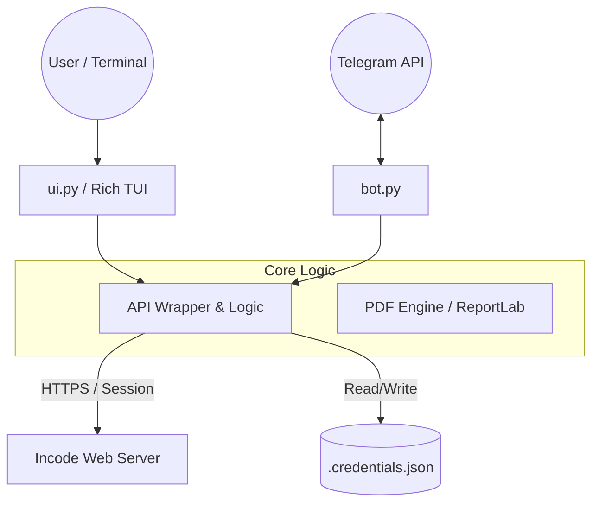

# Incode CLI v1.0


Eine hochoptimierte CLI-Anwendung und ein automatisierter Telegram-Bot zur effizienten Interaktion mit dem **Incode-Dienstplansystem des Roten Kreuzes**.

Dieses Projekt vereint die Funktionalitäten eines interaktiven Terminals mit der Mobilität eines Telegram-Bots. Es wurde entwickelt, um Sanitätern und Führungskräften einen schnellen, gefilterten und übersichtlichen Zugriff auf Einsatzpläne zu ermöglichen – ohne die oft träge Weboberfläche nutzen zu müssen.

## 🚀 Kernfunktionen

### 1. Interaktives Terminal-Interface (CLI)
Das CLI ist das Herzstück für die stationäre Nutzung (z.B. auf der Dienststelle oder am PC):
- **Dashboard:** Eine kompakte Übersicht deiner nächsten Dienste direkt beim Start.
- **Tagesplan-Explorer:** Durchsuche den gesamten Dienstplan für heute oder ein beliebiges Datum.
- **Live-Monitor:** Ein spezialisierter Modus, der den Plan in Echtzeit (Auto-Refresh) anzeigt – ideal für Wachen-Monitore.
- **Intelligente Suche:** Suche nach Kollegen, um deren Einteilungen zu sehen.
- **Daten-Export:** Generiere PDF-Übersichten oder iCal-Dateien.

### 2. Telegram Bot (Mobile Access)
Der Bot dient als dein persönlicher Assistent für die Hosentasche:
- **On-Demand PDF:** Sende `/dienste` oder `/tagesplan` an den Bot und erhalte sofort ein sauber formatiertes PDF.
- **Push-Updates:** Im Live-Modus sendet der Bot bei Planänderungen automatisch Updates in den Chat.

---

## 🛠 Installation & Setup

### Voraussetzungen
- **Python 3.8** oder neuer.
- Ein Computer mit **Linux**, **macOS** oder Windows (via WSL).

### Schnellstart

1. **Repository klonen:**
   ```bash
   git clone https://github.com/manueloberberger/incode-cli.git
   cd incode-cli
   ```

2. **Setup:**
   ```bash
   python3 -m venv .venv
   source .venv/bin/activate
   pip install -r requirements.txt
   chmod +x incode
   ```

3. **Starten:**
   ```bash
   ./incode
   ```

*Tipp: Verlinke das Tool global mit `ln -sf $(pwd)/incode ~/.local/bin/incode`, um es von überall zu starten.*

---

## 🧠 Technical Deep Dive & Architektur

Für Entwickler und technisch Interessierte: Ein Blick unter die Haube von Incode-CLI.

### 1. System-Architektur
Das Projekt folgt einem strikten **Layer-Ansatz**, um UI, Logik und Datenhaltung zu trennen.



### 2. API Reverse Engineering (`src/api.py`)
Da Incode keine öffentliche API bereitstellt, emuliert dieses Tool einen Browser-Client.
*   **Session-Hijacking:** Der Login erfolgt via POST-Request an `login.php`. Das Session-Cookie (`PHPSESSID`) wird gehalten.
*   **Token Extraction:** Kritische Auth-Token (`x-incode-auth`) werden via RegEx direkt aus dem JavaScript-Code der Antwortseite extrahiert.
*   **Hybrid Parsing:**
    *   *Strukturdaten:* Werden via `BeautifulSoup` aus dem HTML geparst.
    *   *Plandaten:* Werden über interne JSON-Endpoints (`loadPlan.json`) abgerufen, die eigentlich für das AJAX-Frontend gedacht sind.

### 3. Real-Time Monitor Engine
Der Live-Monitor (`src/ui.py`) muss stabil über Tage hinweg laufen.
*   **Polling Loop:** Fragt konfigurierbar (z.B. alle 5 Min) den Server ab.
*   **Delta Detection:** Vergleicht den Hash des neuen Dienstplan-Objekts mit dem letzten Zustand. Das UI wird **nur** neu gezeichnet, wenn sich Daten tatsächlich geändert haben (`if new_data != old_data`).
*   **Transient Rendering:** Nutzt `rich.Live(transient=True)`, um Updates flackerfrei im Terminal darzustellen, ohne den Scrollback-Buffer vollzuschreiben.

### 4. On-Demand PDF Engine (`src/pdf.py`)
Statt HTML zu rendern und via Headless-Browser (langsam, schwergewichtig) zu konvertieren, nutzen wir **ReportLab**.
*   **Vorteil:** PDFs werden als Byte-Stream direkt im RAM "gezeichnet".
*   **Performance:** Generierung dauert < 0.1 Sekunden.
*   **Portabilität:** Keine Systemabhängigkeiten wie `wkhtmltopdf` oder `chromium` nötig.

### 5. Security Concepts
*   **Local Storage:** Zugangsdaten liegen in `.credentials.json`.
*   **Permission Hardening:** Beim Erstellen der Datei werden die Rechte automatisch auf `600` (Read/Write only for Owner) gesetzt.
*   **Bot Whitelist:** Der Telegram-Bot prüft bei **jeder** eingehenden Nachricht die `user_id`. Stimmt sie nicht mit der Konfiguration überein, wird die Anfrage stumm verworfen (Silent Drop).

---

## 🏗 Projektstruktur

```
incode-cli/
├── incode.py           # Entry Point & CLI Router
├── src/
│   ├── api.py          # Incode Session, Auth & Data Fetching
│   ├── bot.py          # Telegram Bot Logic & Polling
│   ├── config.py       # Configuration & Credential Management
│   ├── pdf.py          # PDF Generation Engine
│   ├── ui.py           # TUI (Rich) & Interactive Menus
│   └── utils.py        # Helpers (Key handling, Clearscreen)
└── requirements.txt    # Python Dependencies
```

## ❓ Troubleshooting

**Login fehlgeschlagen?**
Lösche die Datei `.credentials.json` und starte das Tool neu, um die Daten sauber neu einzugeben.

**Bot antwortet nicht?**
Der Bot antwortet nur der konfigurierten User-ID. Prüfe deine ID via `@userinfobot` auf Telegram und vergleiche sie mit der Config.

---
*Hinweis: Dieses Tool steht in keiner offiziellen Verbindung zum Roten Kreuz. Es ist ein Community-Projekt zur Verbesserung der Usability.*